<h1 align="center">IKart</h1>

<p align="center">
  A full-stack fashion store built with Django, covering everything from the catalogue and checkout to returns and refunds.<br>
  It also includes Lux, an AI shopping assistant that answers from the live catalogue.
</p>

<p align="center">
  <a href="https://ikart-sg.onrender.com"></a>
  
  
  
</p>

<p align="center">
  <a href="https://ikart-sg.onrender.com"><strong>Open the live store →</strong></a><br>
  <sub>Hosted on Render's free plan, so the first request after a quiet spell can take up to a minute to wake the server.</sub>
</p>

<p align="center">
  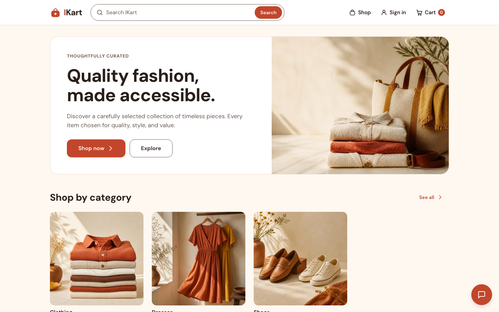
</p>

## About

IKart is an online store for Indian fashion. Shoppers can:

- browse and search the catalogue
- pay by card or UPI through Razorpay, or choose cash on delivery
- track orders and request cancellations or returns
- see refunds through to the bank's reference number

Staff run the whole store from the Django admin.

What makes this build interesting:

- **Money and stock handling.** Every amount comes from one server-side quote. Payments are verified with Razorpay before an order is confirmed, and stock is reserved and released safely.
- **Lux.** The assistant is grounded in the real catalogue, store policies and the shopper's own orders, so it recommends products that actually exist.
- **Free hosting that still works.** It runs on free infrastructure, with fixes for what that brings: no cron jobs and blocked SMTP ports.

## Features

### Browsing and discovery

- Categories with sub-categories.
- Filters for price, brand, minimum rating and on-sale items.
- Sort by newest, price, popularity or rating, with 24 products per page.
- The header search suggests products as you type. If a search finds nothing, it falls back to close matches, so a misspelled product name still finds the product.

<table>
  <tr>
    <td>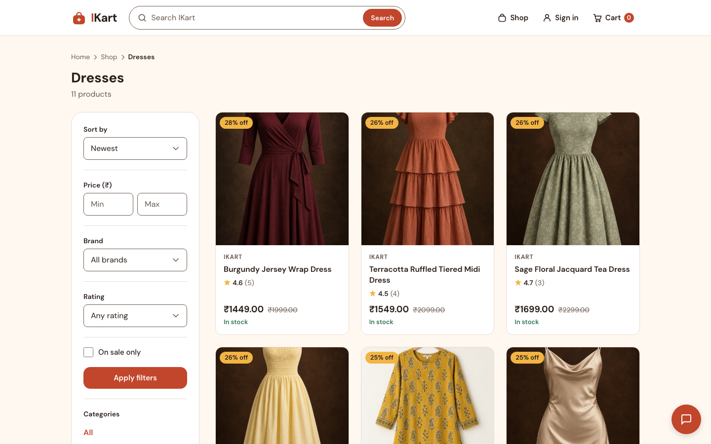</td>
    <td>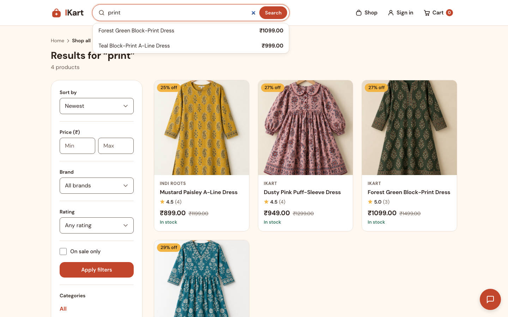</td>
  </tr>
</table>

### Product pages and variants

Each product page has:

- an image gallery, the discount against the original price, and live stock
- customer reviews, with a "Verified purchase" badge for buyers
- product questions and answers
- two recommendation rows built from real behaviour: **Goes well with** (bought together) and **You might like** (viewed together)

Sizes and other options appear as buttons, and sold-out options are greyed out. Staff choose which attribute becomes the buttons for each product (size today; any variant field works). Products without one keep a dropdown.

<p align="center">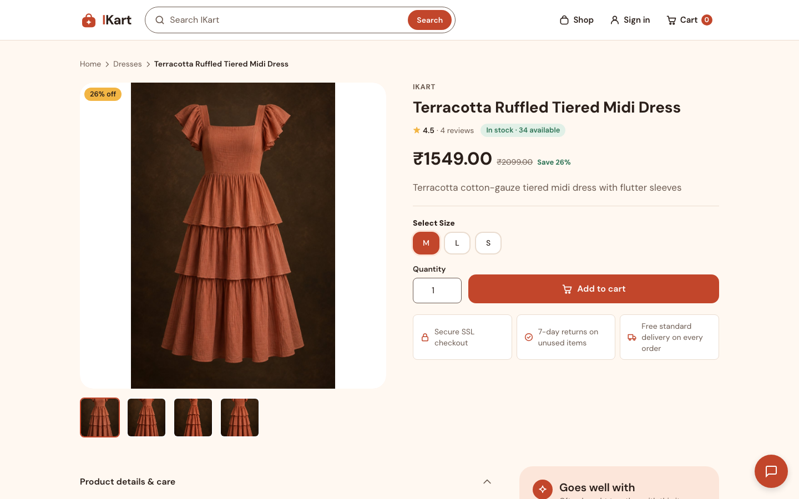</p>

### Cart and checkout

- The cart is kept in the session, so guests can shop freely. Checkout asks them to sign in or create an account, and their cart comes with them.
- Checkout takes coupon codes and saved addresses, and fills in the mobile number from the shopper's profile.
- Delivery is Standard (3–5 days, free) or Express (1–2 days, ₹99).
- Payment is cash on delivery, or card/UPI on a Razorpay-hosted payment page.

<p align="center">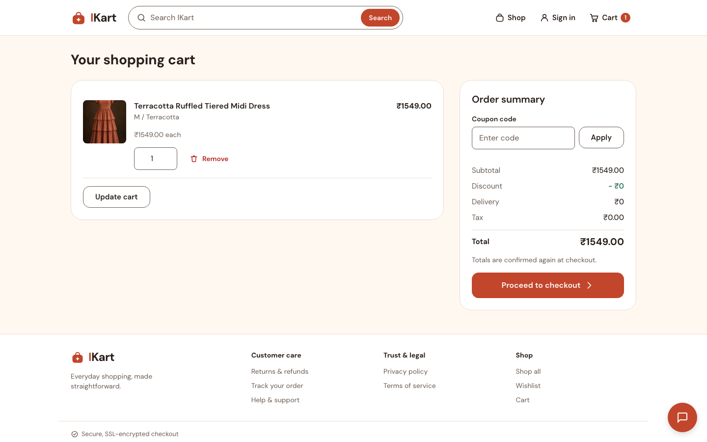</p>

### Orders, returns and refunds

- Each order page shows a progress tracker: Order placed → Shipped → Out for delivery → Delivered. Below it are the shipment's tracking events.
- Customers can ask to cancel before an order ships, or request a return within 7 days of delivery.
- When staff approve a return, the refund goes back through Razorpay. The order page and the confirmation email show the refund amount and the refund reference, plus the bank's reference number (ARN) when the bank provides one.

### Accounts

- New accounts confirm their email with a 6-digit code before they're created.
- Sign-up asks for an Indian mobile number and checks its format. It's stored in `+91` format and used as the default at checkout.
- Also included: password reset and change, a wishlist, saved-for-later, saved addresses, email preferences and support tickets.

### Lux, the shopping assistant

Lux is a chat widget on every page. Each message goes to the model with:

- the store's policies and the active FAQs
- the catalogue products that match the question, with their in-stock sizes
- for order questions from signed-in shoppers, their own recent orders

It is told to recommend only products from that list, to link to real pages, and to reply in the shopper's language. The default provider is Groq (`openai/gpt-oss-20b`), and Claude is a supported alternative.

<table>
  <tr>
    <td width="70%">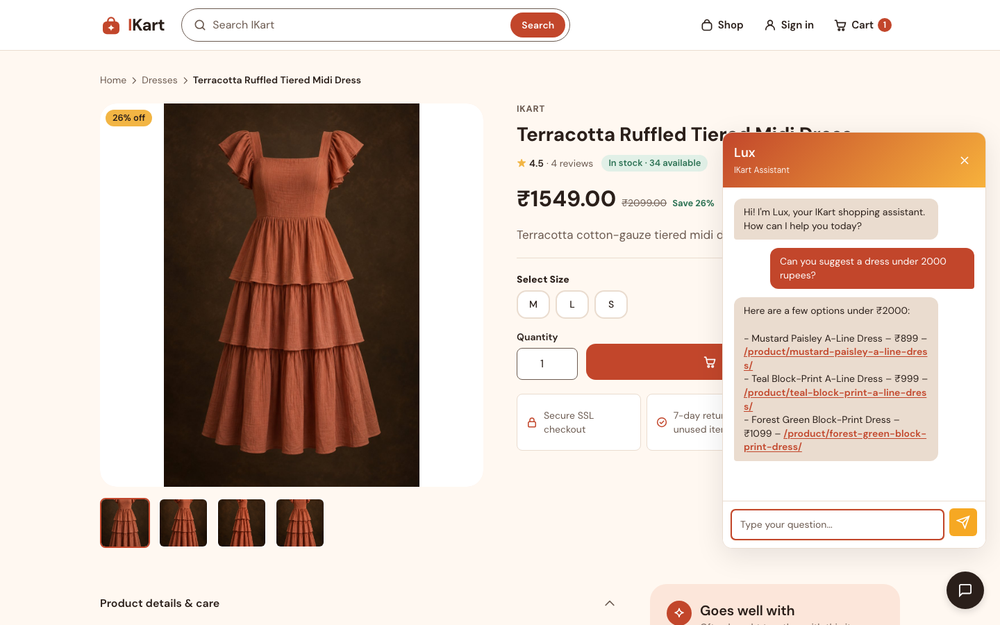</td>
    <td width="30%">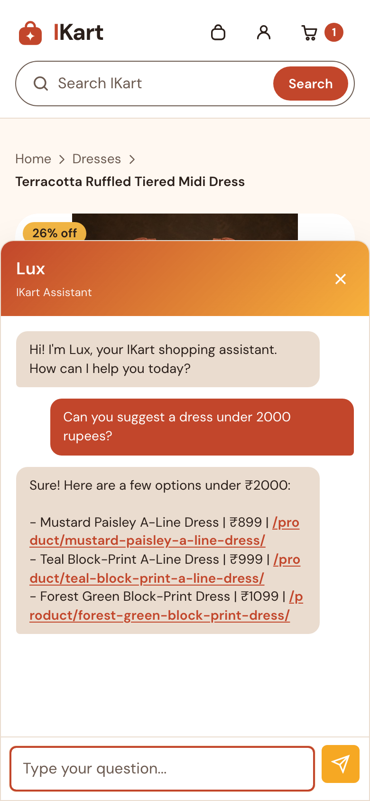</td>
  </tr>
</table>

### Admin

Staff get:

- product editing with inline images and variants, plus CSV import
- low-stock flags and coupon management, including emailing a coupon to customers who opted in
- approval of cancellation and return requests, which triggers the refund
- shipment tracking and support replies
- a staff-only analytics dashboard

## On mobile

Every page is designed for small screens first. On phones, filters fold into a single "Filters & sort" panel, and the size buttons grow to be easy to tap.

<table>
  <tr>
    <td>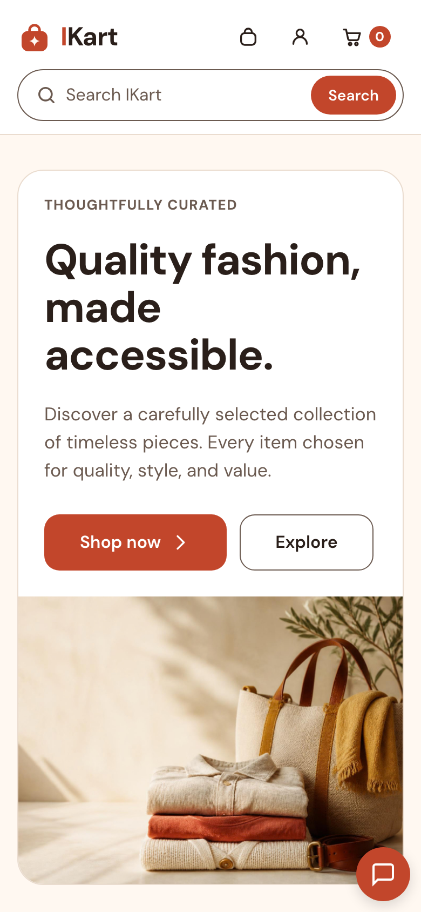</td>
    <td>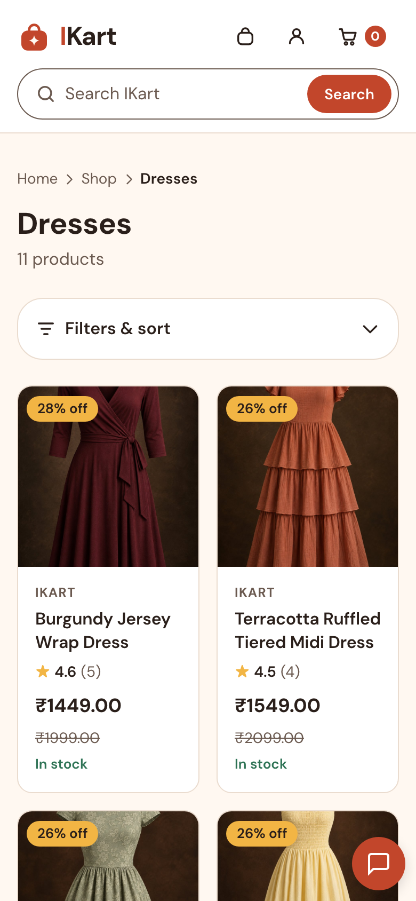</td>
    <td>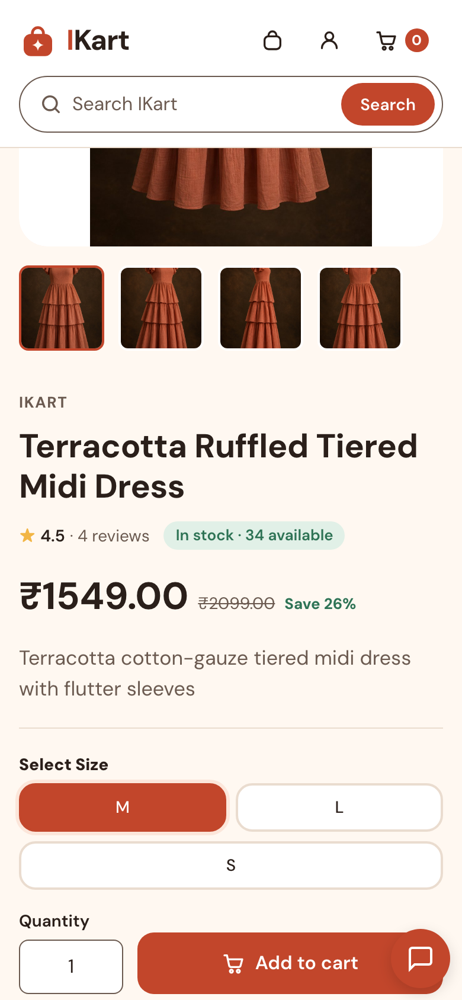</td>
    <td>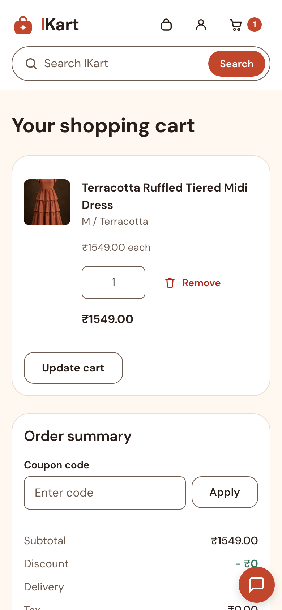</td>
  </tr>
</table>

## Engineering notes

- **One source of truth for money.** `calculate_cart_quote()` produces every amount the cart, checkout and payment use. The Razorpay payment link is created on the server from that quote, never from what the browser sends.
- **Payments are verified, not trusted.**
  - When the shopper returns from Razorpay, the page checks the HMAC signature. It then fetches the payment from Razorpay and matches the amount and currency before capturing it.
  - Webhooks are signature-checked and recorded by event ID, so duplicates are ignored. If processing fails, the event's record is removed and an error is returned, so Razorpay sends it again.
- **Stock is reserved at order time.** Creating an order and deducting stock happen in one database transaction.
  - Unpaid orders give their stock back when the payment fails, when the customer cancels, or after `PAYMENT_RESERVATION_MINUTES`.
  - Render's free plan has no scheduler, so the release check runs from ordinary shopping pages at most every 5 minutes. It can also run as a management command.
- **Built for a single process.** Gunicorn runs one `gthread` worker with 8 threads.
  - Rate limits and caches live in memory, so one process keeps them accurate.
  - The threads keep slow calls to Groq, Razorpay and Brevo from blocking other requests.
- **Rate limits use the real client IP.** On Render every request arrives from `127.0.0.1`, so limits are keyed on Cloudflare's `True-Client-IP`. Login, sign-up, email codes, password reset, checkout and Lux are all limited.
- **Email over HTTP.** Render's free plan blocks SMTP ports, so production sends mail through Brevo's HTTP API (via django-anymail). Locally, emails print to the console.
- **No Node toolchain.** Tailwind is compiled by the official standalone CLI (`scripts/build_css.sh`, SHA-256 checked). WhiteNoise serves the compressed, fingerprinted static files.
- **Fails closed.** `DEBUG` is off unless set. In production the app refuses to start without `SECRET_KEY`, `SITE_URL` and Cloudinary settings, rather than quietly losing uploads.
  - It also adds HSTS, secure cookies and a Content Security Policy.
  - The admin can be moved off `/admin/`.

## Tech stack

| | |
|---|---|
| **Backend** | Python 3.12, Django 5.2, Gunicorn |
| **Database** | PostgreSQL on Neon in production (psycopg 3), SQLite locally |
| **Frontend** | Django templates, Tailwind CSS 3.4, vanilla JavaScript |
| **Media and static files** | Cloudinary, WhiteNoise |
| **Payments** | Razorpay Payment Links and webhooks |
| **Email** | Brevo via django-anymail |
| **AI** | Groq API, Anthropic SDK (Claude) |
| **Hosting** | Render (Singapore) |

## Project structure

```
ikart/                   Django project: settings, root URLs, WSGI
storefront/
├── models.py            Catalogue, orders, payments, returns, support
├── views.py             Storefront, checkout, payment callbacks and webhook
├── services/
│   ├── __init__.py      Cart quotes, stock, payments, refunds, recommendations
│   ├── lux.py           Lux chat orchestration
│   ├── lux_context.py   Catalogue and order lookup for each message
│   ├── lux_prompt.py    Store facts and rules given to the model
│   └── ai_providers.py  Groq and Claude clients
├── payments/            Razorpay Payment Link helpers
├── admin.py             Admin actions, CSV import, refunds
├── templates/           Page templates
├── static/              CSS (including compiled Tailwind), JS, fonts
└── tests.py             Test suite
scripts/build_css.sh     Tailwind standalone build
build.sh                 Render build: install, CSS, collectstatic, migrate
gunicorn.conf.py         Worker and thread settings
render.yaml              Render blueprint
```

## Getting started

You'll need **Python 3.12**. The compiled Tailwind CSS is committed, so you only need `scripts/build_css.sh` after changing Tailwind classes. The script supports Linux x64 and macOS on Apple silicon.

```bash
git clone https://github.com/Navee090603/ikart.git
cd ikart
python3.12 -m venv .venv
source .venv/bin/activate
pip install -r requirements.txt
cp .env.example .env
python manage.py migrate
python manage.py createsuperuser
python manage.py runserver
```

- The store is at http://127.0.0.1:8000 and the admin at http://127.0.0.1:8000/admin/.
- A new database starts empty. Add categories and products in the admin, or use **Products → Import CSV**.
- Sign-up codes and order emails print in the `runserver` terminal.

**Tests:**

```bash
python manage.py test storefront
```

**Environment variables** go in `.env`. The full list is in [`.env.example`](.env.example). The main ones:

| Variable | Purpose |
|---|---|
| `SECRET_KEY`, `DEBUG`, `ALLOWED_HOSTS`, `SITE_URL` | Core Django settings. `SITE_URL` is required when `DEBUG` is off. |
| `DATABASE_URL` | PostgreSQL connection string. If it's not set, SQLite is used. |
| `CLOUDINARY_URL` | Product image storage. Required in production. |
| `RAZORPAY_KEY_ID`, `RAZORPAY_KEY_SECRET`, `RAZORPAY_WEBHOOK_SECRET` | Card/UPI payments. Without them, checkout offers cash on delivery only. |
| `BREVO_API_KEY`, `DEFAULT_FROM_EMAIL` | Production email. The sender must be verified in Brevo. |
| `AI_PROVIDER`, `GROQ_API_KEY` (or `CLAUDE_API_KEY`) | Lux. `AI_PROVIDER` is `groq` (default) or `claude`. |
| `ADMIN_URL` | Moves the admin to a custom path. |

To release unpaid reservations on demand (the app also does this automatically):

```bash
python manage.py release_stale_payment_reservations
```

## Deploying on Render

`render.yaml` describes a free Python web service:

- **Build:** `./build.sh` installs requirements, compiles Tailwind, runs `collectstatic` and applies migrations.
- **Start:** `gunicorn ikart.wsgi:application`, which picks up `gunicorn.conf.py` automatically.
- **Health check:** `/healthz/`, which also confirms the database responds.

Set the environment variables above in the Render dashboard. `GROQ_API_KEY` isn't listed in `render.yaml`, so add it by hand. The database is external, set through `DATABASE_URL`; the live site uses Neon.

For payments, add a Razorpay webhook pointing at `https://<your-domain>/payments/razorpay/webhook/`. Subscribe it to these events:

- `payment.captured`, `payment.failed` and `payment_link.paid`
- `order.paid`
- `refund.created`, `refund.processed` and `refund.failed`

Then copy its secret into `RAZORPAY_WEBHOOK_SECRET`.
